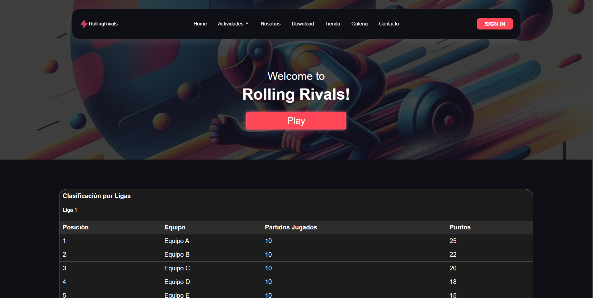
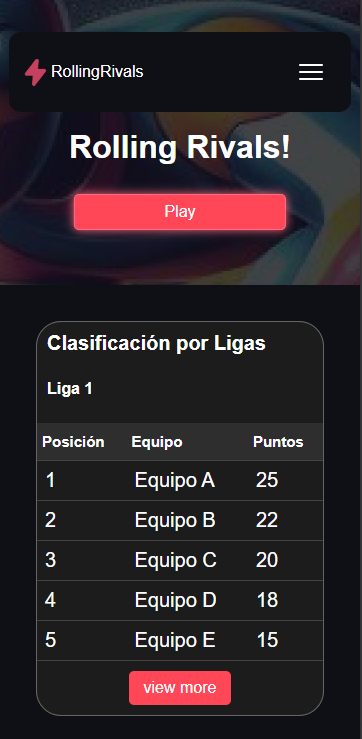

# Funcionalidades Responsive y CSS  - Entrega 3 CSS

## **Tabla de Contenidos**
1. [Responsive](#Responsive)
2. [CSS](#CSS)
3. [Funcionalidades CSS / JS](#Funcionalidades-CSS-JS)
4. [Otras Funcionalidades](#Otras-Funcionalidades)

---
## Responsive

### **Uso de media queries para Responsive design**
El diseño responsivo se implementa mediante media queries los diferentess ficheros [CSS](/css/). Por ejemplo:

```css   
@media and Screen (max-width: 768px) { /* Versión mobile*/
    body {
        font-size: 14px;
    }
}
```
### Algunas Capturas del diseño responsive:

#### Versión desktop

#### Versión mobile


---
## CSS

### **Uso de Variables CSS con `:root`**  

Las variables CSS se declaran en el selector `:root` para permitir . Por ejemplo:
un uso sencillo de la paleta de colores en hexdecimal en todo el proyecto. Ejemplo:
```css
:root {
    --primary-color: #3498db;
    --secondary-color: #2ecc71;
    --font-main: 'Roboto', sans-serif;
    --padding: 16px;
}
```

### Ventajas:
- Reutilización de estilos.
- Fácil mantenimiento y cambios globales en el diseño.
- Consistencia en colores, tamaños y tipografías.

Estas variables son utilizadas a lo largo del proyecto de la siguiente manera:

```css
dov {
    font-family: var(--font-main);
    color: var(--primary-color);
    padding: var(--padding);
}
```

---
### **Uso de `@import`**  

Se utiliza la regla `@import` para organizar el código CSS en módulos y facilitar su mantenimiento. Por ejemplo:

Archivo `styles.css`:
```css
@import url('assets.css');
@import url('colors.css');
```

Esto permite:
- Dividir estilos en diferentes archivos según componentes o funcionalidades.
- Facilitar la lectura y el mantenimiento del código.

#### Nota: 
- Para optimizar el rendimiento, es recomendable compilar los archivos en producción en uno solo.

---
### **Uso de `transiciones` , `transform` y `Keyframes`**

#### **Transiciones**:

Archivo `about.css`
```CSS
.image-bottom-left, .image-top-right {
    transition: ease-in-out 300ms;
}
```

#### **Transform**:
Archivo `galeria_estadios.css`
```CSS
.cs-stadium-card:hover img {
    transform: scale(1.05); 
}
```

#### **Keyframes**:
Archivo `about.css`:
```css
@keyframes colorchange {
    0% {
        color: #ff4757; 
    }
    25% {
        color: #1e90ff; 
    }
    50% {
        color: #2ed573; 
    }
    75% {
        color: #ff6348; 
    }
    100% {
        color: #ff4757; 
    }
}

.about-text h3 .colored {  
    animation: colorchange 5s infinite; // Uso del keyframe
}
```
---
## Funcionalidades CSS / JS

### Menu Hamburguer

El menú hamburguesa es un componente interactivo que mejora la navegación en la aplicación, especialmente en dispositivos móviles o con pantallas más pequeñas. Este menú se representa con un ícono de tres líneas horizontales (similar a una "hamburguesa") y tiene las siguientes características principales:

- Interfaz compacta: El menú se encuentra oculto por defecto, lo que permite maximizar el espacio disponible en la pantalla para el contenido principal.
- Despliegue intuitivo: Al hacer clic o tocar el ícono del menú, se despliega una lista con las opciones de navegación disponibles.
- Cierre fácil: El menú puede cerrarse haciendo clic en el ícono nuevamente o en cualquier área fuera del menú.
- Adaptación responsive: En dispositivos con pantallas más grandes, el menú puede mostrarse como una barra de navegación fija, eliminando la necesidad de interacción adicional.
- Acceso rápido: Las opciones dentro del menú están organizadas para permitir un acceso rápido a las principales secciones de la aplicación.

---

## Otras Funcionalidades

### Buscador por equipos

El buscador por equipos es una herramienta interactiva diseñada para filtrar y mostrar información relevante sobre diferentes equipos.

#### Ejemplo de Implementación Técnica
1. **HTML**:
   - Incluye un campo de entrada (`<input>`) donde los usuarios pueden escribir el nombre o criterio de búsqueda.
   - Los equipos se listan dinámicamente en un contenedor, como una lista (`<ul>`).

   ```html
   <input type="text" id="search-input" placeholder="Buscar equipo...">
   <ul id="team-list">
       <li>Equipo A</li>
       <li>Equipo B</li>
       <li>Equipo C</li>
   </ul>
   ```

2. **CSS**:
   - Se aplican estilos para destacar el campo de búsqueda y la lista de equipos.
   - Opcionalmente, se puede resaltar el equipo encontrado con un color diferente.

   ```css
   #search-input {
       width: 100%;
       padding: 0.5em;
       margin-bottom: 1em;
       font-size: 1em;
   }

   #team-list li {
       padding: 0.5em;
       border-bottom: 1px solid #ccc;
   }

   #team-list li.highlight {
       background-color: yellow; /* Resalta los resultados */
   }
   ```

3. **JavaScript**:
   - Filtra dinámicamente los elementos de la lista en función del texto ingresado.
   - Se utiliza el evento `keypress` para detectar cambios en el campo de búsqueda al pulsar enter.

   ```javascript
   const searchInput = document.getElementById('search-input');
   const teamList = document.getElementById('team-list');
   const teams = teamList.getElementsByTagName('li');

   searchInput.addEventListener('keypress', () => {
        if(event.key === 'Enter') {
            const filter = searchInput.value.toLowerCase();
            for (let team of teams) {
                const text = team.textContent.toLowerCase();
                team.style.display = text.includes(filter) ? '' : 'none';
            }
        }
   });
   ```
---

### Generación de Items de Producto

La generación de ítems de producto permite mostrar automáticamente una lista o galería de productos basada en datos predefinidos, como un array de objetos. Esto simplifica la creación de contenido dinámico y personalizado.

#### Ejemplo Implementación Técnica
1. **HTML**:
   - Se utiliza un contenedor vacío (`<div>`) donde los productos se generarán dinámicamente.

   ```html
   <div id="product-container"></div>
   ```

2. **CSS**:
   - Los productos se presentan como tarjetas (`cards`) para facilitar su visualización.
   - Estilos adicionales aseguran que el diseño sea atractivo y responsivo.

   ```css
   .product-card {
       border: 1px solid #ccc;
       padding: 1em;
       margin: 0.5em;
       border-radius: 5px;
       box-shadow: 0 2px 5px rgba(0, 0, 0, 0.1);
   }

   .product-card h3 {
       margin: 0 0 0.5em;
   }
   ```

3. **JavaScript**:
   - Los productos se generan dinámicamente a partir de un array de objetos que contiene datos como el nombre, descripción y precio.
   - Se manipula el DOM para insertar los productos en el contenedor.

   ```javascript
   const products = [
       { name: 'Producto 1', description: 'Descripción del producto 1', price: '$10' },
       { name: 'Producto 2', description: 'Descripción del producto 2', price: '$20' },
       { name: 'Producto 3', description: 'Descripción del producto 3', price: '$30' },
   ];

   const productContainer = document.getElementById('product-container');

   products.forEach(product => {
       const productCard = document.createElement('div');
       productCard.className = 'product-card';
       productCard.innerHTML = `
           <h3>${product.name}</h3>
           <p>${product.description}</p>
           <p><strong>${product.price}</strong></p>
       `;
       productContainer.appendChild(productCard);
   });
   ```

#### Ventajas
- **Automatización**: Simplifica la creación de listas o catálogos.
- **Escalabilidad**: Fácil de integrar con bases de datos, php o APIs externas.
- **Estilización**: Las tarjetas son personalizables para cumplir con cualquier diseño, tanto desktop como mobile.